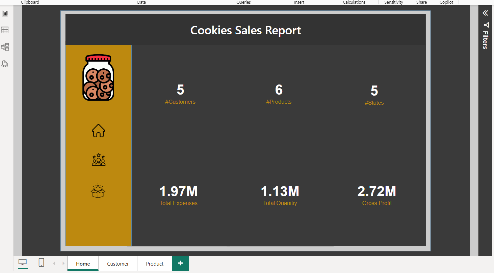

# 📊 Power BI Sales Dashboard

## 📖 Project Overview
This project presents an interactive **Power BI** dashboard designed to offer insights into sales performance, customer demographics, and product analysis. The dashboard is structured into three main sections:

1. **📈 Report Visualizations**: Interactive dashboards with key insights.
2. **📋 Data Tables**: Raw data tables for Customer, Product, and Sales data.
3. **🔗 Data Model**: Relationships between tables in the dataset.

[

## 📊 Report Visualizations

The **Report Visualizations** section consists of dynamic charts and KPIs, organized into three key tabs:

- **🏠 Home Tab**: Features a business overview with metrics such as total sales, average revenue per transaction, and the top-performing products.
  
  

- **👥 Customer Tab**: Provides insights into customer demographics and behaviors.
  
  

- **🛍️ Products Tab**: Focuses on product performance and profitability analysis.
  
  

The visualizations are interactive, enabling users to filter data by time period, customer type, region, and product category to drill down into specific insights.

---

## 📋 Data Tables

The **Data Tables** section contains raw data and calculated fields for the following tables:

- **Customer Table**: Includes customer-specific information such as customer ID, name, region, and segment.
  
  

- **Product Table**: Contains details about each product, including product ID, product name, category, and price.
  
  

- **Sales Table**: Provides transaction-level data, including sales date, customer ID, product ID, and sales amount.
  
  

---

## 🔗 Data Model

The **Data Model** illustrates the relationships between the **Customer**, **Product**, and **Sales** tables, ensuring that data flows correctly between them. This enables accurate analysis across multiple tables in the dataset.

- **Table Relationships**: Shows how the tables are connected using keys such as **Customer ID** and **Product ID**.
- **Data Structure**: The model is designed to enable cross-table calculations and aggregations.

---

## 📊 Dataset

### Dataset Overview
The dataset used in this project consists of sales transactions, customer information, and product details. Key fields in each table include:

- **Customer Table**:
  - Customer ID
  - Customer Name
  - Region
  - Segment
- **Product Table**:
  - Product ID
  - Product Name
  - Category
  - Price
- **Sales Table**:
  - Transaction ID
  - Date
  - Customer ID
  - Product ID
  - Sales Amount

### Data Preparation
- **Data Import**: The dataset was imported into Power BI, and tables were created for customers, products, and sales.
- **Data Transformation**: Data was cleaned and transformed using Power Query.
- **Relationships**: Relationships were established between the **Customer**, **Product**, and **Sales** tables using the **Data Model** for seamless analysis.

---

## ✨ Key Features

- **📊 Interactive Dashboards**: The report visualizations are dynamic, allowing users to filter and explore data by date, region, customer segment, and product category.
- **📋 Detailed Data Tables**: Explore raw data for the **Customer**, **Product**, and **Sales** tables.
- **🔗 Comprehensive Data Model**: Relationships between tables ensure that data from different sources can be aggregated and analyzed effectively.

---

## 🛠 Tools Used

- **Power BI**: For building the interactive dashboard, data modeling, and visualizations.
- **Power Query**: For data transformation and cleaning.
- **DAX (Data Analysis Expressions)**: Used to create calculated fields and metrics.
- **Excel**: The raw dataset was prepped and cleaned using Excel before being imported into Power BI.

---

